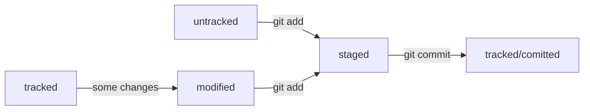

# Практическая работа №1. «Делимся проектом с миром»

## Part 1. Terminal

### 1. Main commands<br>
**cd** (**c**hange **d**irectory) - to get to the directory where you going to work <br>
	_example:_ cd Downloads/PhD - you will get to subfolder PhD in folder Downloads <br>
**git init** - to initialize git repository in current folder<br>
**rm -rf .git** - to delete .git if you have some troubles<br>
**git status** - to check status<br>

### 2. Add files to repository<br>
**git add --all**, **git add .** - to start tracking files<br>
**git commit**, **git commit -m "Text"** - to save changes<br>
**git log** - to see history logs<br>
	
### 3. SSH keys generating <br>
**ls -la .ssh** - to check existing keys<br>
**ssh-keygen -t ed25519 -C "_электронная почта, к которой привязан ваш аккаунт на GitHub_"** - to create new keys<br>
**pbcopy < ~/.ssh/id_rsa.pub** - to copy key to clipboard

## Part 2. GitHub.com

### 1. SSH key linking<br>
**Settings -> SSH and GPG keys -> New SSH key -> Add SSH key** - workflow to add key<br>
**ssh -T git@github.com** - to check status<br>
### 2. Connecting
**git remote add origin git@github.com:%ИМЯ_АККАУНТА%/first-project.git** - to link local and remote repositories <br>
**git remote -v** - to check it<br>
### 3. Pull/Push
**git push -u origin main** - to pushing for the first time<br>
**git push** - to push data to repository<br>
**git pull** - to pull data from repository<br>


# Практическая работа №2. Дополняем шпаргалку

## Хеш

	git log - вызвать список коммитов

Git хеширует (преобразует) информацию о коммите с помощью алгоритма **SHA-1** (от англ. Secure Hash Algorithm — «безопасный алгоритм хеширования») и получает для каждого коммита _свой уникальный хеш_ — результат хеширования.

**Хеш** — основной идентификатор коммита и позволяет узнать его автора, дату и содержимое закоммиченных файлов.

Все хеши, а также таблицу соответствий хеш → информация о коммите Git хранит в папке **.git**

## Структура коммита

Разберём элементы, из которых состоит описание:
строка из цифр и латинских букв после слова commit — это хеш коммита;<br>
**Author** — имя автора и его электронная почта;<br>
**Date** — дата и время создания коммита;<br>
в конце находится сообщение коммита.

	commit e83c5163316f89bfbde7d9ab23ca2e25604af290
	Author: Linus Torvalds <torvalds@linux-foundation.org>
	Date:   Thu Apr 7 15:13:13 2005 -0700

	git log --oneline - вызвать сокращенный список коммитов

## HEAD

Файл **HEAD** (англ. «голова», «головной») — один из служебных файлов папки .git. Он указывает на коммит, который сделан последним (то есть на самый новый).

Если нужно передать последний коммит, то вместо его хеша можно просто написать слово HEAD — Git поймёт, что вы имели в виду последний коммит.

	cat HEAD

## Статусы файлов в Git

- untracked/tracked
- staged
- modified



**Just for case:**
```mkdir my_project
cd my_project
git init
```

[Гит](https://www.github.com "GitHub")